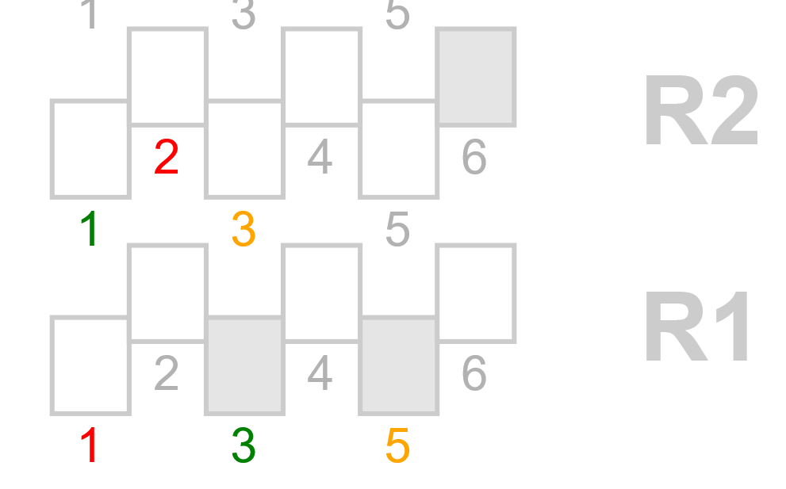
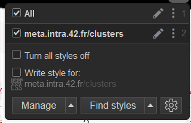

# 42Madrid-stylus
A beginner friendly approach to applying custom CSS styles to 42Madrid's intra page

## Brief concept guide

### CSS

[CSS](https://developer.mozilla.org/en-US/docs/Web/CSS) stands for Cascading Style Sheets. It is a language used to describe the presentation of a document written in HTML or XML (including XML dialects such as SVG, MathML, etc.). CSS describes how elements should be rendered on screen or on other media. Webpages define their own style rules and apply them to their HTML elements but users can also apply their own styles to webpages using browser extensions or custom stylesheets.

### Stylus

From [their site](https://add0n.com/stylus.html): _Stylus injects its own CSS into targeted pages and therefore makes you able to override the present design of a webpage. If you know CSS, you can write and create your own styles. Otherwise you can just install styles by other authors from [userstyles.org](userstyles.org) (USO). You can also search for styles for the current site on USO from within the Stylus extension._

## Purpose and application on 42 Madrid's intra webpage

### Cluster overviews

#### Thumbnail sizes

Default image size might be small for some users as to easily identify peers, specially on desktop.
This rule increases size of the thumbnails container to 250% of the original size and applies the `!important` flag to override any other related styles.

`.map-container {width: 250% !important;}`

#### Devices unavailable or with other issues

Some devices might be down temporarily or have other issues like Bluetooth connectivity ones where, for example, paired headphones output poor sound quality regardless of system settings, even when not paired with other ones or when scan is off (see [bluetoothctl](https://manpages.debian.org/unstable/bluez/bluetoothctl.1.en.html)).
While some students don't need or connect Bluetooth devices, the purpose of this particular rule set is to easily identify which devices have issues and which ones don't and, hopefully, help debug the underlying cause.
To do so, red, yellow or green color is added to seat numbers identified as such and comments added on top to name the specific device and issue.

Clusters view example:


Applied CSS:
```css
/* c1r1s5 bad BT */
#cluster-24 g.r1.middle text:nth-child(6)
```
where selectors up to cluster are the previous elements, `#cluster-24` identifies the cluster (1), `r1.middle` the row (1), and `text:nth-child(6)` the seat (5).
Cluster and seat numbers are not intuitively numbered so it's recommended to check/preview changes to identify the correct selector before making any changes.

### Installation

The Stylus extension is available on most browsers and can be installed from their respective extension stores. The style set for this project can be found and installed from [UserStyles.world](https://userstyles.world/style/19331/42madrid-clusters) or in this [repo](./).
[Contributions](##Contributing) are welcome and changes updated as soon as possible.


#### Config on Stylus

Mods can be applied globally, to a specific site, or to a specific URL. In the case of clusters overview, the default config looks like so:

where "All" is a rule set that is applying to all sites and "meta.intra.42.fr/clusters" only applies its rules to that subpage.

---

## Contributing

If you'd like to contribute to this project, here are some simple guidelines to get you started.

### Setting up local development

1. Clone the repository
```bash
git clone https://github.com/AdrianSkar/42Madrid-stylus.git
cd repository
```

### Making changes

1. Create a new branch for your feature or fix
```bash
git checkout -b feature/your-feature-name
# or
git checkout -b fix/issue-you-are-fixing
```

2. Make your changes

3. Commit your changes with a clear message
```bash
git add .
git commit -m "update[bt]: c1s6r6 working properly" # or "fix[avatars]: thumbnail size to 250%"
```

### Submitting a pull request

1. Push your branch to GitHub
```bash
git push origin feature/your-feature-name
```

2. Go to the repository on GitHub and click "New Pull Request"

3. Select your branch and fill in the PR template with:
   - A clear title describing your changes
   - A detailed description of what you changed and why
   - Any related issues or dependencies
   - Screenshots if applicable

### Guidelines

- Follow the existing code style and formatting
- Write clear commit messages following [Conventional Commits](https://www.conventionalcommits.org/)
- One feature/fix per PR to keep changes focused

### Additional resources

- [GitHub Flow Guide](https://guides.github.com/introduction/flow/)
- [How to Write a Good Pull Request](https://github.blog/2015-01-21-how-to-write-the-perfect-pull-request/)
- [GitHub Docs: Contributing to Projects](https://docs.github.com/en/get-started/quickstart/contributing-to-projects)

### Questions?

Feel free to open an issue if you have any questions or suggestions!